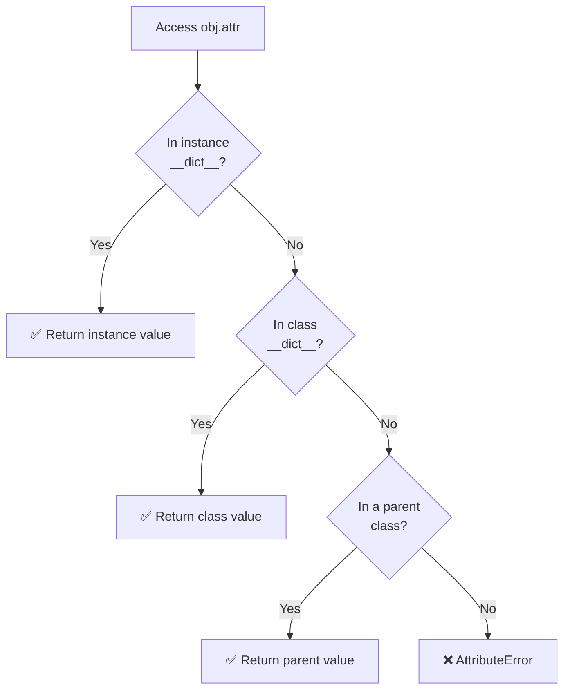
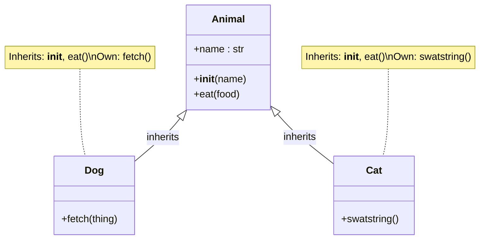
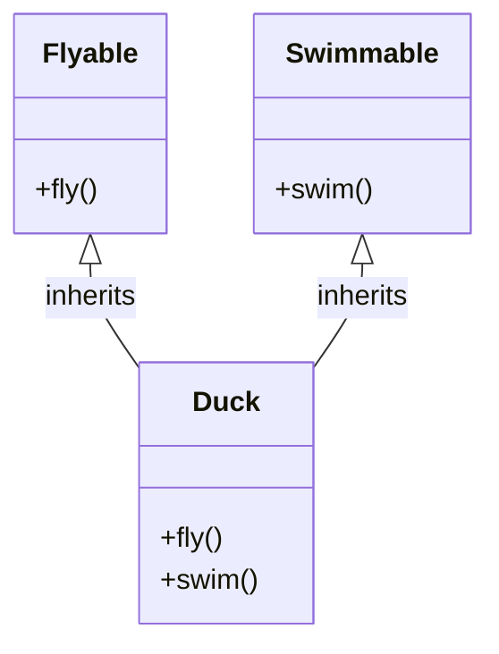
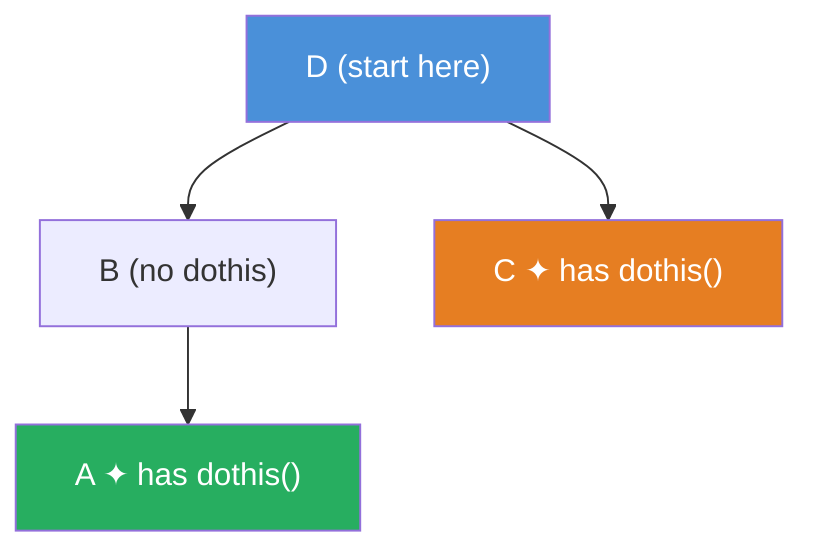
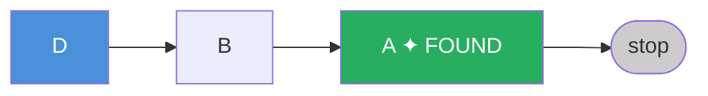
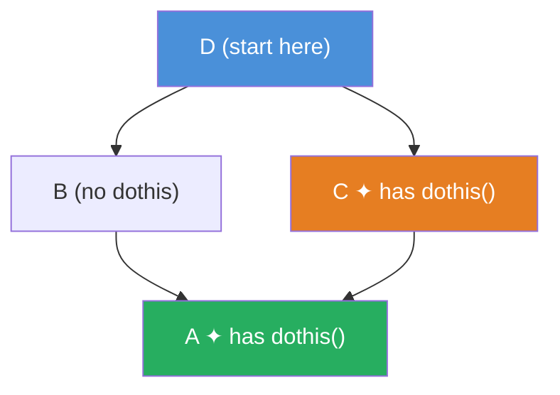
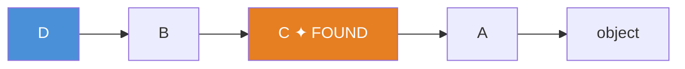
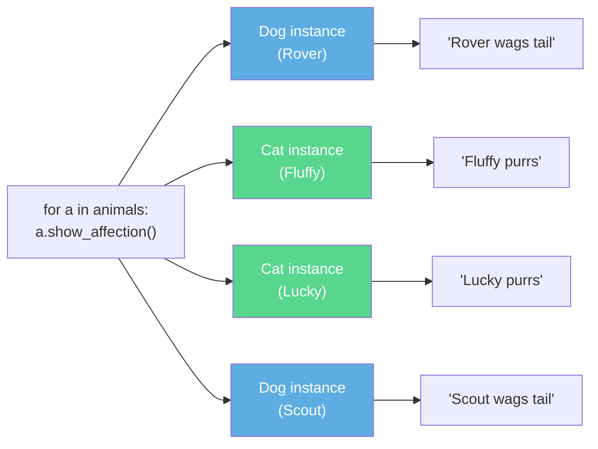
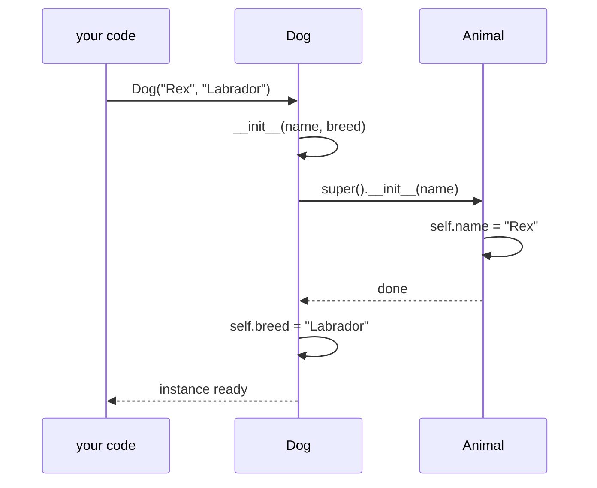
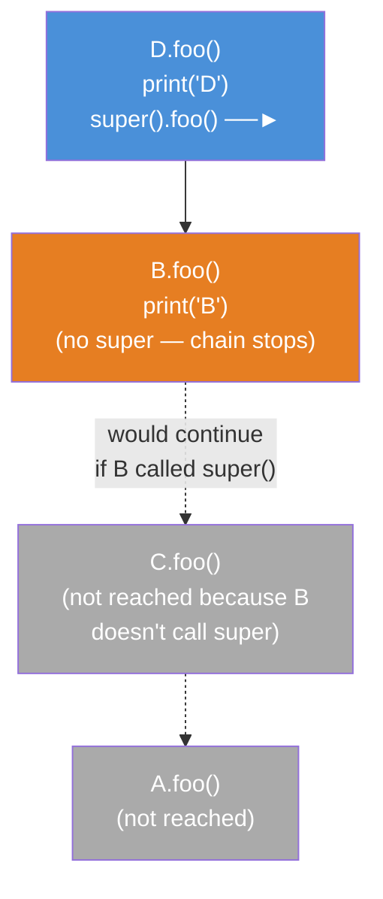

# Phase 4 : Object Oriented Programming in Python

A deep-dive study guide covering core OOP concepts in Python, with annotated code examples and detailed explanations. Originally written as interview preparation notes; expanded to be a complete senior-level reference.

---

## Table of Contents

01. [Classes](#01-classes)
02. [Instances, Instance Methods, Instance Attributes](#02-instances-instance-methods-instance-attributes)
03. [Class Attributes](#03-class-attributes)
04. [The `__init__` Constructor](#04-the-__init__-constructor)
05. [Encapsulation](#05-encapsulation)
06. [Inheritance](#06-inheritance)
07. [Multiple Inheritance and Method/Attribute Lookup](#07-multiple-inheritance-and-methodattribute-lookup)
08. [Method Resolution Order (MRO)](#08-method-resolution-order-mro)
09. [Polymorphism](#09-polymorphism)
10. [Instance Methods (Bound Methods)](#10-instance-methods-bound-methods)
11. [Class Methods](#11-class-methods)
12. [Static Methods](#12-static-methods)
13. [Decorators](#13-decorators)
14. [Magic Methods (Dunder Methods)](#14-magic-methods-dunder-methods)
15. [Abstract Base Classes](#15-abstract-base-classes)
16. [Method Overloading](#16-method-overloading)
17. [super()](#17-super)
18. [Descriptors](#18-descriptors)
19. [`__slots__`](#19-__slots__)
20. [Metaclasses](#20-metaclasses)
21. [`__new__` vs `__init__`](#21-__new__-vs-__init__)

---

## 01. Classes

A **class** is the fundamental building block of Object Oriented Programming. Think of it as a blueprint or template that describes the structure and behavior of objects created from it.

A class does two things: it defines what **data** an object will hold (its attributes), and what **actions** that object can perform (its methods). Defining a class is a declaration — it tells Python what the objects should look like, but no memory is allocated for data until you actually create an instance.

One of Python's key characteristics is that **everything is an object**, including integers, strings, functions, and classes themselves. Every object belongs to some class (also called its type), and that class determines what you can do with the object.

```python
class Dog(object):
    pass
```

`object` is the root of Python's class hierarchy — it is the base class from which all classes implicitly inherit. In Python 3, `class Dog:` and `class Dog(object):` are exactly equivalent. In Python 2, you had to write `class Dog(object):` explicitly to get a **new-style class**; omitting `object` gave you an old-style class with subtly different behavior (particularly around MRO and `super()`). Always use new-style classes.

**Key terminology:**

| Term | Meaning |
| --- | --- |
| Class | The blueprint / template |
| Instance | A concrete object created from a class |
| Attribute | Data stored on a class or instance |
| Method | A function defined inside a class |

**Visualizing a class as a blueprint:**

```text
┌────────────────────────────────────────┐
│  CLASS  Dog          ← the blueprint  │
│  ──────────────────────────────────── │
│  Attributes:  name, breed             │
│  Methods:     bark()                  │
│               fetch(thing)            │
└──────────────┬─────────────────────────┘
               │  Dog("Rover")   Dog("Fido")
               │  instantiate ──────────────────────┐
               ▼                                    ▼
  ┌────────────────────────┐      ┌────────────────────────┐
  │  INSTANCE  rover       │      │  INSTANCE  fido        │
  │  ────────────────────  │      │  ────────────────────  │
  │  name  = "Rover"       │      │  name  = "Fido"        │
  │  breed = "Labrador"    │      │  breed = "Poodle"      │
  └────────────────────────┘      └────────────────────────┘
```

Each instance is independent — `rover.name` and `fido.name` have different values and changing one never affects the other.

---

## 02. Instances, Instance Methods, Instance Attributes

### Instances

An **instance** is a concrete object created from a class using the call syntax `ClassName()`. Each instance is a completely independent object that lives at its own memory address. Even if two instances have the same attribute values, they are distinct objects — changing one will never affect the other.

When you write `Dog()`, Python internally calls `Dog.__new__(Dog)` to allocate memory for the new object, and then `Dog.__init__(instance)` to initialize it. This two-step process is what creates the object you work with.

```python
class Dog(object):
    def bark(self):
        print("Woof!")

rover = Dog()   # rover is an instance of Dog
fido  = Dog()   # fido  is a separate instance of Dog

rover.bark()    # Woof!
fido.bark()     # Woof!
```

### Instance Attributes

**Instance attributes** are data that belong to a specific instance. They are created by assigning to `self.something` inside a method — most commonly inside `__init__`. Each instance gets its own copy of every instance attribute, stored in the instance's `__dict__` dictionary.

Because instance attributes live on the instance itself, two instances of the same class can have completely different values for the same attribute name. The attribute name is shared (it's part of the class definition), but the value is per-instance.

```python
class Dog(object):
    def __init__(self, name):
        self.name = name   # instance attribute

rover = Dog("Rover")
fido  = Dog("Fido")

print(rover.name)   # Rover
print(fido.name)    # Fido  — completely independent
```

You can also add instance attributes dynamically outside of `__init__`:

```python
rover.age = 3   # valid, but not recommended — attributes should be declared in __init__
```

Defining all instance attributes in `__init__` is best practice because it makes the class's data contract explicit and predictable.

### Instance Methods

**Instance methods** are ordinary methods that operate on an instance. They always receive `self` as their first argument, which is the handle to the calling instance. Through `self`, the method can read and modify the instance's attributes. Any method you define in a class that takes `self` is an instance method.

The name `self` is just a convention — Python doesn't enforce the name — but you should always use `self` because every Python programmer expects it.

```python
class Dog(object):
    def __init__(self, name):
        self.name = name

    def bark(self):
        print(f"{self.name} says Woof!")

rover = Dog("Rover")
rover.bark()   # Rover says Woof!
```

When you write `rover.bark()`, Python automatically passes `rover` as the `self` argument. This is equivalent to `Dog.bark(rover)`. Understanding this equivalence is important — it explains what "bound method" means (see section 10).

---

## 03. Class Attributes

**Class attributes** are defined directly on the class body, outside any method. They are shared across all instances of the class — there is only one copy of the attribute, and all instances reference it.

This is fundamentally different from instance attributes. A class attribute is like a global variable scoped to the class: it exists even before any instance is created, and every instance reads it from the same place (the class's `__dict__`).

```python
class YourClass(object):
    classy = 10          # class attribute

    def set_val(self):
        self.insty = 100  # instance attribute (set inside a method)

dd = YourClass()
print(dd.classy)   # 10  — fetched from the class
dd.set_val()
print(dd.insty)    # 100 — fetched from the instance
```

### Attribute Lookup Order

When you access `obj.attr`, Python doesn't immediately know whether `attr` lives on the instance or on the class. It follows a deterministic lookup chain:

**instance → class → parent classes (in MRO order)**



This has an important consequence: if you **assign** to an instance attribute with the same name as a class attribute, you don't modify the class attribute — you create a new instance attribute that *shadows* the class one. The class attribute still exists, unchanged, and other instances still see it.

```python
class YourClass(object):
    classy = "class value"

dd = YourClass()
print(dd.classy)       # "class value"  — from the class

dd.classy = "Instance value"
print(dd.classy)       # "Instance value" — from the instance (shadows class attr)

del dd.classy          # remove the instance-level shadow
print(dd.classy)       # "class value"  — falls back to the class
```

### Class Attributes as Shared State

Class attributes are useful for tracking shared state, such as a count of all instances ever created:

```python
class InstanceCounter(object):
    count = 0   # shared across all instances

    def __init__(self, val):
        self.val = val
        InstanceCounter.count += 1   # update the class attribute directly

a = InstanceCounter(5)
b = InstanceCounter(10)
c = InstanceCounter(15)

print(InstanceCounter.count)   # 3
```

Notice that we update the count using `InstanceCounter.count += 1`, not `self.count += 1`. If we wrote `self.count += 1`, that would create a *per-instance* copy of `count` (shadowing the class attribute), which defeats the purpose of shared state.

**Important:** Mutating a mutable class attribute (like a list) through an instance mutates the shared copy. Reassigning it (`self.attr = new_value`) creates an instance-level copy instead.

```python
class MyClass(object):
    items = []   # shared mutable list — DANGER

    def add(self, item):
        self.items.append(item)   # mutates the shared list

a = MyClass()
b = MyClass()
a.add("hello")
print(b.items)   # ["hello"] — b sees the change too!
```

If you want each instance to have its own list, initialize it in `__init__`:

```python
class MyClass(object):
    def __init__(self):
        self.items = []   # each instance gets its own list
```

---

## 04. The `__init__` Constructor

`__init__` is a **magic method** (also called a dunder method — double underscore) that Python calls automatically when a new instance is created. It is the class constructor, or more precisely, the initializer — the place where you set up the initial state of each instance.

When you write `MyNum()`, Python first allocates a blank object via `__new__`, then immediately calls `__init__` on that object to fill it in. You almost never override `__new__`; `__init__` is where your setup code lives.

```python
class MyNum(object):
    def __init__(self):
        print("Instance created!")
        self.val = 0    # set initial state

    def increment(self):
        self.val += 1
        print(self.val)

dd = MyNum()    # prints "Instance created!"
dd.increment()  # 1
dd.increment()  # 2
```

### `__init__` with Arguments

`__init__` can accept arguments to configure each instance differently. This is how you pass data in at creation time, rather than setting attributes after the fact:

```python
class MyNum(object):
    def __init__(self, value):
        try:
            value = int(value)
        except ValueError:
            value = 0
        self.value = value

    def increment(self):
        self.value += 1
        print(self.value)

a = MyNum(10)
a.increment()   # 11
a.increment()   # 12
```

### `__init__` is not `__new__`

`__init__` *initializes* an already-created object. The actual memory allocation happens in `__new__`, which runs before `__init__`. In practice you rarely override `__new__` unless implementing singletons or immutable types like subclasses of `int` or `str`. See [section 21](#21-__new__-vs-__init__) for a full treatment.

---

## 05. Encapsulation

**Encapsulation** is the principle of bundling data and the methods that operate on that data within a class, and restricting direct access to internal state. The goal is to ensure that an object's internal state can only be changed through a well-defined public interface, never by reaching in and modifying attributes directly from outside.

This matters in practice because internal state often has invariants — rules that must hold for the object to be in a valid state. For example, a `BankAccount` should never have a negative balance, and a `Temperature` should never go below absolute zero. If external code can set the attribute directly, there's no way to enforce these rules. The setter method is where validation lives.

Encapsulation also allows you to change the internal implementation later without breaking external code, as long as the public interface (method names and signatures) stays the same.

```text
                  ╔══════════════════════════════════════════╗
                  ║           BankAccount object             ║
                  ║                                          ║
                  ║   ┌──────────────────────────────────┐   ║
                  ║   │    Private / Internal State      │   ║
                  ║   │    __balance = 1000              │   ║
                  ║   └──────────────────────────────────┘   ║
                  ║                                          ║
                  ║   Public Interface  (the only door in)   ║
                  ║   ┌────────────┐  ┌───────────────────┐  ║
                  ║   │ deposit()  │  │  get_balance()    │  ║
                  ║   └─────▲──────┘  └────────▲──────────┘  ║
                  ╚═════════╪═══════════════════╪════════════╝
                            │                   │
                     external code         external code
                     calls deposit()      calls get_balance()

  ✅  acct.deposit(50)          — goes through the interface
  ❌  acct.__balance = 9999     — breaks encapsulation (bypasses validation)
```

### Basic Example

```python
class MyClass(object):
    def set_val(self, val):
        self.value = val

    def get_val(self):
        return self.value

a = MyClass()
a.set_val(10)
print(a.get_val())   # 10
```

### Breaking Encapsulation

Python does **not** enforce encapsulation at the language level. You can bypass a setter and write directly to the attribute:

```python
a = MyClass()
a.set_val(10)
a.value = 999    # bypasses set_val() — breaking encapsulation
print(a.get_val())  # 999
```

This is **bad practice** because the setter may contain validation logic. If you bypass it, you lose those guarantees:

```python
class MyInteger(object):
    def set_val(self, val):
        try:
            val = int(val)
        except ValueError:
            return
        self.val = val

    def get_val(self):
        print(self.val)

    def increment_val(self):
        self.val += 1

b = MyInteger()
b.val = "MyString"   # breaking encapsulation — now val is a string
b.get_val()          # prints "MyString"
b.increment_val()    # TypeError: can only concatenate str (not "int") to str
```
### Name Mangling for Private Attributes

Python uses **name mangling** as a convention for pseudo-private attributes. There is no truly private attribute in Python — the language makes bypassing access controls intentionally possible if you know what you're doing — but naming conventions communicate intent:

- `_name` — **single underscore**: "internal use by convention." Not enforced by the interpreter. It's a signal to other developers: "this is an implementation detail, you shouldn't depend on it." `from module import *` will skip these names.
- `__name` — **double underscore**: Python physically renames this to `_ClassName__name` inside the class definition. This makes accidental access from outside harder (but still possible if you know the mangled name). The primary purpose is to avoid name clashes in subclasses, not to enforce security.

```python
class BankAccount(object):
    def __init__(self, balance):
        self.__balance = balance   # name-mangled to _BankAccount__balance

    def deposit(self, amount):
        self.__balance += amount

    def get_balance(self):
        return self.__balance

acct = BankAccount(100)
acct.deposit(50)
print(acct.get_balance())      # 150
# print(acct.__balance)        # AttributeError
print(acct._BankAccount__balance)  # 150 — still accessible, just harder
```

### Properties: The Pythonic Way

Using raw getters and setters like `get_val()` / `set_val()` works, but it's not idiomatic Python. The `@property` decorator provides a clean way to add getter/setter/deleter logic while keeping the external interface looking like a simple attribute access. This means callers can write `t.celsius = 0` instead of `t.set_celsius(0)`, which is more natural, while still triggering validation logic.

```python
class Temperature(object):
    def __init__(self, celsius):
        self._celsius = celsius

    @property
    def celsius(self):
        return self._celsius

    @celsius.setter
    def celsius(self, value):
        if value < -273.15:
            raise ValueError("Temperature below absolute zero!")
        self._celsius = value

    @property
    def fahrenheit(self):
        return self._celsius * 9 / 5 + 32

t = Temperature(100)
print(t.celsius)      # 100
print(t.fahrenheit)   # 212.0
t.celsius = 0
print(t.fahrenheit)   # 32.0
```

`@property` is actually syntactic sugar over the **descriptor protocol** — see [section 18](#18-descriptors) for how this works under the hood.

---

## 06. Inheritance

**Inheritance** allows a class (the **child** or **subclass**) to acquire the attributes and methods of another class (the **parent** or **superclass**). This enables code reuse and lets you model "is-a" relationships in your domain: a `Dog` *is-a* `Animal`, a `SavingsAccount` *is-a* `BankAccount`.

The practical benefit is that you write shared behavior once in the parent, and all children get it automatically. You only write code in the child that is different or new. This also means bugs fixed in the parent are fixed everywhere.



```python
class Animal(object):
    def __init__(self, name):
        self.name = name

    def eat(self, food):
        print(f"{self.name} is eating {food}")


class Dog(Animal):          # Dog inherits from Animal
    def fetch(self, thing):
        print(f"{self.name} goes after the {thing}")


class Cat(Animal):          # Cat also inherits from Animal
    def swatstring(self):
        print(f"{self.name} shreds the string!")


d = Dog("Roger")
c = Cat("Fluffy")

d.fetch("paper")    # Dog's own method
d.eat("dog food")   # inherited from Animal

c.eat("cat food")   # inherited from Animal
c.swatstring()      # Cat's own method
```

**Key rules:**

- A child class inherits **all** methods and attributes from the parent.
- Sibling classes (`Dog` and `Cat`) cannot access each other's methods.
- A child can **override** a parent method by defining one with the same name.
- The parent class being inherited from is also called the **base class**.

### Inheriting `__init__`

If a child class does not define its own `__init__`, it inherits the parent's. This means instantiating `Dog("Roger")` will call `Animal.__init__` and set `self.name`:

```python
class Animal(object):
    def __init__(self, name):
        self.name = name

class Dog(Animal):
    def fetch(self, thing):
        print(f"{self.name} goes after the {thing}")

d = Dog("Roger")   # uses Animal's __init__
print(d.name)      # Roger
d.fetch("frizbee")
```

If the child defines its own `__init__`, it completely replaces the parent's — unless you explicitly call the parent's `__init__` using `super()` (see [section 17](#17-super)).

### Overriding Methods

A child class can override any parent method. When Python looks up the method, it finds the child's version first (instance → class → parent, per the lookup chain), so the parent's version is never called unless you explicitly invoke it:

```python
class Animal(object):
    def speak(self):
        print("...")

class Dog(Animal):
    def speak(self):        # overrides Animal.speak
        print("Woof!")

class Cat(Animal):
    def speak(self):        # overrides Animal.speak
        print("Meow!")

Dog().speak()   # Woof!
Cat().speak()   # Meow!
```

---

## 07. Multiple Inheritance and Method/Attribute Lookup

Python allows a class to inherit from **multiple parent classes** simultaneously. This is a powerful but complex feature — when used carelessly it can create hard-to-debug method resolution issues. When used deliberately (especially with `super()` cooperative calling), it is the foundation of Python's mixin pattern.



```python
class Flyable(object):
    def fly(self):
        print("Flying!")

class Swimmable(object):
    def swim(self):
        print("Swimming!")

class Duck(Flyable, Swimmable):
    pass

d = Duck()
d.fly()    # inherited from Flyable
d.swim()   # inherited from Swimmable
```

**Mixins** are a common use of multiple inheritance. A mixin is a class that provides some narrowly-scoped functionality (like serialization, logging, or caching) but is not meant to stand alone. You "mix it in" to another class to add that functionality without inheritance depth.

### Attribute Lookup Chain

When you access `instance.attribute`, Python follows this chain:
1. The instance's own `__dict__`
2. The instance's class
3. Parent classes in **MRO order** (see next section)


---

## 08. Method Resolution Order (MRO)

**MRO** defines the order in which Python searches classes for a method or attribute when using inheritance. In a single-inheritance chain, the order is obvious: start at the instance's class, then go up the chain. In multiple inheritance, the order is ambiguous — multiple paths lead to potentially different methods. The MRO is the tiebreaker.

Understanding the MRO is critical for writing correct multiple-inheritance code, using `super()` correctly, and debugging unexpected method calls.

### Viewing the MRO

```python
print(ClassName.mro())
# or
print(ClassName.__mro__)
```

### The C3 Linearization Algorithm

Python 3 (and Python 2 new-style classes from 2.3 onwards) uses the **C3 linearization algorithm**, not a naive depth-first search. C3 guarantees:

- The class itself comes first.
- A class always appears before its parents.
- The order in which parents are listed in the class definition is preserved.
- No class appears more than once (duplicates are resolved by keeping the *last* occurrence).

These guarantees are what make `super()` work correctly in multiple inheritance — each `super()` call in a chain passes control to the *next* class in the MRO, so every class in the hierarchy gets a turn.

### Simple Inheritance — Depth-First

```text
D inherits from B and C.
B inherits from A.
Both A and C define dothis().

Naive depth-first path: D → B → A → C → A
MRO (with C3):          D → B → A → C → object
```



MRO lookup path for `D().dothis()`:



```python
class A(object):
    def dothis(self): print("doing this in A")

class B(A): pass

class C(object):
    def dothis(self): print("doing this in C")

class D(B, C): pass

d = D()
d.dothis()       # "doing this in A"  — found in A before reaching C
print(D.mro())   # [D, B, A, C, object]
```
### Diamond Inheritance — C3 Removes Duplicates

The **diamond problem** arises when two parents both inherit from the same grandparent. Naive depth-first would visit the grandparent twice — once through each path — potentially calling the same method twice or seeing the wrong version.

```text
D inherits from B and C.
B inherits from A.
C inherits from A.
Both A and C define dothis().

Naive path:    D → B → A → C → A   (A appears twice)
C3 MRO:        D → B → C → A       (A's early occurrence removed)
```

The shape of this hierarchy gives it its name — the **diamond problem**:



C3 MRO pushes `A` to the end so each class appears exactly once:



`D().dothis()` resolves to **C**, not A — because C3 delayed A until after C.

```python
class A(object):
    def dothis(self): print("doing this in A")

class B(A): pass

class C(A):
    def dothis(self): print("doing this in C")

class D(B, C): pass

d = D()
d.dothis()       # "doing this in C"  — C comes before A in the MRO
print(D.mro())   # [D, B, C, A, object]
```

Because `A` appears in both `B`'s and `C`'s lineage, C3 pushes `A` to the end — after `C`. So the method is found in `C`, not `A`.

**Interview tip:** When asked "which method gets called?", trace the MRO using `ClassName.mro()`. Never guess.

---

## 09. Polymorphism

**Polymorphism** means "many forms." In OOP, it means different classes can expose the same interface (method name), but each class implements it differently. The caller doesn't need to know what type it's dealing with — it just calls the method and trusts that each type will handle it correctly.

This is the mechanism that makes generic code possible. You can write a function that operates on a list of animals, calls `speak()` on each one, and doesn't need to know or care whether each animal is a Dog, Cat, or anything else. New animal types can be added later without changing the function.



### Polymorphism through Inheritance

```python
class Animal(object):
    def __init__(self, name):
        self.name = name

class Dog(Animal):
    def show_affection(self):
        print(f"{self.name} wags tail")

class Cat(Animal):
    def show_affection(self):
        print(f"{self.name} purrs")

animals = [Dog("Rover"), Cat("Fluffy"), Cat("Lucky"), Dog("Scout")]
for a in animals:
    a.show_affection()   # each class handles it differently
```

### Duck Typing

Python's polymorphism is rooted in **duck typing**: "If it walks like a duck and quacks like a duck, it's a duck." Python doesn't care about the declared type of an object — it only cares whether the object has the method you're trying to call, determined at runtime. This is unlike statically-typed languages like Java or C++, where polymorphism requires explicit inheritance or interface declarations.

Duck typing means you can write polymorphic code without any common base class:

```python
class Duck:
    def speak(self): print("Quack!")

class Person:
    def speak(self): print("I'm speaking!")

for obj in (Duck(), Person()):
    obj.speak()   # works — both have speak()
```

No common base class needed.

### Built-in Polymorphism

Python's built-in functions are themselves polymorphic. `len()` works on strings, lists, dicts, and any object that implements `__len__`:

```python
print(len("Hello"))             # 5
print(len([1, 2, 3]))           # 3
print(len({"a": 1, "b": 2}))   # 2
```

Internally, `len(x)` calls `x.__len__()`. Any class that defines `__len__` participates in this protocol.

---

## 10. Instance Methods (Bound Methods)

Instance methods are the default method type in Python. They take `self` as their first parameter, giving them access to the calling instance.

When you access an instance method via `instance.method`, Python returns a **bound method** — the function is bound to the instance, meaning `self` is automatically filled in. This binding is what makes `rover.bark()` work without passing `rover` explicitly.

The binding happens through the **descriptor protocol** — specifically, function objects implement `__get__`, which is invoked when you access the method via an instance. When called on the class directly, no binding occurs and you get a plain function.

```python
class A(object):
    def method(self):
        return self

a = A()
print(a.method)
# <bound method A.method of <__main__.A object at 0x...>>
```

Calling `a.method()` is exactly equivalent to calling `A.method(a)`. Python inserts `a` as the first argument automatically — this is the mechanism behind `self`.

```python
class InstanceCounter(object):
    count = 0

    def __init__(self, val):
        self.val = val
        InstanceCounter.count += 1

    def set_val(self, newval):
        self.val = newval

    def get_val(self):
        return self.val

    def get_count(self):
        return InstanceCounter.count

a = InstanceCounter(5)
b = InstanceCounter(10)
c = InstanceCounter(15)

for obj in (a, b, c):
    print(f"Value: {obj.get_val()}, Count: {obj.get_count()}")
```

---

## 11. Class Methods

A **class method** is decorated with `@classmethod`. Instead of receiving the instance (`self`) as the first argument, it receives the **class itself** (`cls`). This means it operates on the class rather than on a specific instance. Because it receives the class, it can access class attributes and create new instances — but it cannot access instance attributes, because there may be no instance at all when the method is called.

The key use cases are:
- **Factory methods**: alternative constructors that create instances in different ways.
- **Class-level state**: methods that read or update shared class attributes.
- **Subclass awareness**: because `cls` is the actual class the method was called on (not necessarily the class that defines it), class methods work correctly with inheritance.

```python
class MyClass(object):
    @classmethod
    def class_method(cls):
        print(f"Called on class: {cls}")

    def instance_method(self):
        print(f"Called on instance: {self}")

MyClass.class_method()     # works — called on the class directly
MyClass().class_method()   # also works — cls is still MyClass
# MyClass.instance_method()  # TypeError — no instance to bind self
MyClass().instance_method() # works
```

### Common Use Case: Factory Methods and Class-Level State

```python
class MyClass(object):
    count = 0

    def __init__(self, val):
        self.val = val
        MyClass.count += 1

    def get_val(self):
        return self.val

    @classmethod
    def get_count(cls):
        return cls.count   # cls is MyClass here

obj1 = MyClass(10)
obj2 = MyClass(20)

print(MyClass.get_count())   # 2 — no instance needed
print(obj1.get_count())      # 2 — also accessible via instance
```

**Class methods as alternative constructors** is a common pattern:

```python
class Date(object):
    def __init__(self, year, month, day):
        self.year, self.month, self.day = year, month, day

    @classmethod
    def from_string(cls, date_string):
        year, month, day = map(int, date_string.split("-"))
        return cls(year, month, day)   # cls() calls __init__

d = Date.from_string("2024-04-17")
print(d.year, d.month, d.day)   # 2024 4 17
```

Note the use of `cls(year, month, day)` instead of `Date(year, month, day)`. This is important: if someone subclasses `Date`, `cls` will be the subclass, so the factory method will return an instance of the correct type rather than always returning a base `Date`.

### Visual: What Each Method Type Can See

```text
 ┌─────────────────────────────────────────────────────────────────────────┐
 │                          MyClass                                        │
 │                                                                         │
 │  class_attr = 0    ◄──────── shared class-level data                   │
 │                                                                         │
 │  def __init__(self):                                                    │
 │      self.inst_attr = 10   ◄── per-instance data                       │
 │                                                                         │
 │  ┌──────────────────┐  ┌──────────────────┐  ┌──────────────────────┐  │
 │  │  Instance Method │  │  Class Method    │  │  Static Method       │  │
 │  │  def m(self):    │  │  @classmethod    │  │  @staticmethod       │  │
 │  │                  │  │  def m(cls):     │  │  def m():            │  │
 │  │  ✅ inst_attr    │  │  ❌ inst_attr    │  │  ❌ inst_attr        │  │
 │  │  ✅ class_attr   │  │  ✅ class_attr   │  │  ⚠️  class_attr      │  │
 │  │     via self     │  │     via cls      │  │     only via         │  │
 │  │                  │  │                  │  │     MyClass.attr     │  │
 │  └──────────────────┘  └──────────────────┘  └──────────────────────┘  │
 │  Called via instance    Via class OR instance  Via class OR instance    │
 └─────────────────────────────────────────────────────────────────────────┘
```

### Comparison: instance method vs class method vs static method

| | Instance Method | Class Method | Static Method |
| --- | --- | --- | --- |
| First arg | `self` (instance) | `cls` (class) | none |
| Access instance state? | yes | no | no |
| Access class state? | yes (via `self.__class__`) | yes (via `cls`) | only explicitly |
| Called on class directly? | no | yes | yes |
| Decorator | none | `@classmethod` | `@staticmethod` |

---

## 12. Static Methods

A **static method** is decorated with `@staticmethod`. It receives neither `self` nor `cls`. It is essentially a regular function that lives inside a class for organizational purposes — it has no special access to the class or its instances.

You should use a static method when the function is logically related to the class (it would be strange to define it outside), but doesn't need to read or write any class or instance state. Common examples include validation helpers, factory utilities that don't need the class reference, or mathematical operations associated with a type.

The distinction from a class method is subtle but important: a class method gets `cls` and can therefore be polymorphic — it behaves differently when called on a subclass. A static method is completely decoupled from the class hierarchy.

```python
class MyClass(object):
    count = 0

    def __init__(self, val):
        self.val = self.filterint(val)   # calling static method from __init__
        MyClass.count += 1

    @staticmethod
    def filterint(value):
        if not isinstance(value, int):
            print("Value is not an int, defaulting to 0")
            return 0
        return value

a = MyClass(5)
b = MyClass("hello")   # Value is not an int, defaulting to 0
print(a.val)           # 5
print(b.val)           # 0
print(MyClass.filterint(42))   # callable on the class directly
```

```python
class MyClass(object):
    count = 0

    def __init__(self, name):
        self.name = name
        MyClass.count += 1

    @staticmethod
    def status():
        print(f"Total instances: {MyClass.count}")

MyClass("Alpha")
MyClass("Beta")
MyClass("Gamma")

MyClass.status()   # Total instances: 3
```

**When to use which:**

- Use **instance method** when the method needs to read or write instance state.
- Use **class method** when the method operates on class-level state or serves as an alternative constructor.
- Use **static method** when the method is a utility that doesn't need access to either.

---

## 13. Decorators

A **decorator** is a function that takes another function (or class) as input, wraps it with additional behavior, and returns the modified function. The `@decorator_name` syntax is syntactic sugar for:

```python
my_function = decorator(my_function)
```

Decorators are one of Python's most powerful metaprogramming tools. They allow you to factor out cross-cutting concerns — things like logging, access control, caching, timing, and input validation — without polluting the core logic of each function. Instead of copying the same try/except block into every function, you write the behavior once as a decorator and apply it with a one-liner.

**What a decorator actually does — before and after:**

```text
BEFORE decoration                AFTER  @my_decorator
─────────────────                ────────────────────────────────────────
                                 ┌──────────────────────────────────────┐
                                 │  inner_decorator()   ← what you call │
                                 │  ┌────────────────────────────────┐  │
                                 │  │  print("Before the function")  │  │
┌─────────────────────┐          │  ├────────────────────────────────┤  │
│  my_decorated()     │  ──────► │  │  my_decorated()  ← original   │  │
│                     │          │  │  print("This happened!")       │  │
│  print("This        │          │  ├────────────────────────────────┤  │
│         happened!") │          │  │  print("After the function")   │  │
└─────────────────────┘          │  └────────────────────────────────┘  │
                                 └──────────────────────────────────────┘
```

The original function is **wrapped** — it still runs, but now surrounded by the decorator's extra behavior.

### Anatomy of a Decorator

```python
def my_decorator(my_function):        # (1) receives the function to wrap
    def inner_decorator():            # (2) defines the wrapper
        print("Before the function")  # (3) runs before
        my_function()                 # (4) calls the original
        print("After the function")   # (5) runs after
    return inner_decorator            # (6) returns the wrapper, not the result

@my_decorator
def my_decorated():
    print("This happened!")

my_decorated()
# Before the function
# This happened!
# After the function
```

### Decorators with Timestamps

```python
import datetime

def my_decorator(inner):
    def inner_decorator():
        print(datetime.datetime.utcnow())
        inner()
        print(datetime.datetime.utcnow())
    return inner_decorator

@my_decorator
def decorated():
    print("This happened!")

decorated()
# 2024-04-17 10:00:00.000001
# This happened!
# 2024-04-17 10:00:00.000045
```

### Decorators with Arguments

When the decorated function accepts arguments, the wrapper must accept them too:

```python
import datetime

def my_decorator(inner):
    def inner_decorator(num_copy):        # mirrors decorated()'s signature
        print(datetime.datetime.utcnow())
        inner(int(num_copy) + 1)          # can transform the args
        print(datetime.datetime.utcnow())
    return inner_decorator

@my_decorator
def decorated(number):
    print(f"This happened: {number}")

decorated(5)
# 2024-04-17 10:00:00.000001
# This happened: 6
# 2024-04-17 10:00:00.000038
```

### Universal Decorators with `*args` and `**kwargs`

To write a decorator that works on any function regardless of signature, use `*args` and `**kwargs`:

```python
def decorator(inner):
    def inner_decorator(*args, **kwargs):
        print(f"This function takes {len(args)} positional argument(s)")
        inner(*args, **kwargs)
    return inner_decorator

@decorator
def greet(name):
    print(f"Hello, {name}!")

@decorator
def add(a, b):
    print(f"Sum: {a + b}")

greet("Alice")   # This function takes 1 positional argument(s)  /  Hello, Alice!
add(3, 4)        # This function takes 2 positional argument(s)  /  Sum: 7
```

### Practical Example: Exception Handling Decorator

```python
def handle_exceptions(func):
    def inner(*args, **kwargs):
        try:
            return func(*args, **kwargs)
        except Exception as e:
            print(f"An exception was thrown: {e}")
    return inner

@handle_exceptions
def divide(x, y):
    return x / y

print(divide(8, 2))    # 4.0
print(divide(8, 0))    # An exception was thrown: division by zero
```

### Practical Example: Output Multiplier

```python
def double(my_func):
    def inner_func(a, b):
        return 2 * my_func(a, b)
    return inner_func

@double
def adder(a, b):
    return a + b

@double
def subtractor(a, b):
    return a - b

print(adder(10, 20))       # 60  (2 * 30)
print(subtractor(6, 1))    # 10  (2 * 5)
```

### Class Decorators

Decorators can be applied to entire classes. A class decorator receives the class as its argument and should return a class:

```python
def honorific(cls):
    class HonorificCls(cls):
        def full_name(self):
            return "Dr. " + super().full_name()
    return HonorificCls

@honorific
class Name(object):
    def __init__(self, first, last):
        self.first = first
        self.last = last

    def full_name(self):
        return f"{self.first} {self.last}"

print(Name("Vimal", "A.R").full_name())   # Dr. Vimal A.R
```

### The `functools.wraps` Best Practice

Wrapping a function with a decorator causes a subtle problem: the wrapper function replaces the original, so `func.__name__` and `func.__doc__` now reflect the *wrapper*, not the original function. This breaks introspection, documentation tools, and stack traces.

Always use `functools.wraps` in production decorators to copy the original function's metadata onto the wrapper:

```python
import functools

def my_decorator(func):
    @functools.wraps(func)   # preserves func's metadata
    def wrapper(*args, **kwargs):
        print("Before")
        result = func(*args, **kwargs)
        print("After")
        return result
    return wrapper

@my_decorator
def greet():
    """Says hello."""
    print("Hello!")

print(greet.__name__)   # greet  (not "wrapper")
print(greet.__doc__)    # Says hello.
```

---

## 14. Magic Methods (Dunder Methods)

**Magic methods** (also called **dunder methods**, from *d*ouble *under*score) are special methods that Python calls implicitly to implement operators, built-in functions, and protocols. They are the engine behind Python's data model — the mechanism that makes Python's operators, iteration protocol, context managers, and container types work.

The key insight is that Python's operators are not special syntax baked into the interpreter — they are just method calls. When you write `a + b`, Python calls `a.__add__(b)`. When you write `len(x)`, Python calls `x.__len__()`. This means you can make any class participate in any Python protocol just by implementing the right dunder methods.

All magic methods follow the pattern `__name__`.

### `__repr__` and `__str__`

- `__repr__`: machine-readable representation, used by `repr()` and in the REPL. The goal is to produce a string that, ideally, could be used to recreate the object (`eval(repr(obj)) == obj`). Always define this; it's the fallback for `__str__` if `__str__` isn't defined.
- `__str__`: human-readable representation, used by `print()` and `str()`. Use this for display text, not reconstruction. Falls back to `__repr__` if not defined.

```python
class PrintList(object):
    def __init__(self, my_list):
        self.mylist = my_list

    def __repr__(self):
        return str(self.mylist)

    def __str__(self):
        return f"PrintList({self.mylist})"

pl = PrintList(["a", "b", "c"])
print(pl)          # PrintList(['a', 'b', 'c'])  — calls __str__
print(repr(pl))    # ['a', 'b', 'c']             — calls __repr__
```

### Operators as Magic Methods

Every operator in Python maps to a magic method. When you write `a + b`, Python calls `a.__add__(b)`.

```python
my_list_1 = ["a", "b", "c"]
my_list_2 = ["d", "e", "f"]

print(my_list_1 + my_list_2)            # ['a', 'b', 'c', 'd', 'e', 'f']
print(my_list_1.__add__(my_list_2))     # same result — + calls __add__
```

### Common Magic Methods Reference

| Category | Method | Triggered by |
| --- | --- | --- |
| Representation | `__repr__` | `repr(obj)`, REPL display |
| Representation | `__str__` | `print(obj)`, `str(obj)` |
| Lifecycle | `__init__` | `ClassName(...)` |
| Lifecycle | `__new__` | object allocation (before `__init__`) |
| Lifecycle | `__del__` | garbage collection |
| Arithmetic | `__add__` | `a + b` |
| Arithmetic | `__sub__` | `a - b` |
| Arithmetic | `__mul__` | `a * b` |
| Arithmetic | `__truediv__` | `a / b` |
| Arithmetic | `__floordiv__` | `a // b` |
| Arithmetic | `__mod__` | `a % b` |
| Arithmetic | `__pow__` | `a ** b` |
| Comparison | `__eq__` | `a == b` |
| Comparison | `__ne__` | `a != b` |
| Comparison | `__lt__` | `a < b` |
| Comparison | `__le__` | `a <= b` |
| Comparison | `__gt__` | `a > b` |
| Comparison | `__ge__` | `a >= b` |
| Container | `__len__` | `len(obj)` |
| Container | `__getitem__` | `obj[key]` |
| Container | `__setitem__` | `obj[key] = val` |
| Container | `__delitem__` | `del obj[key]` |
| Container | `__contains__` | `item in obj` |
| Container | `__iter__` | `for x in obj` |
| Container | `__next__` | `next(obj)` |
| Context manager | `__enter__` | `with obj as x:` |
| Context manager | `__exit__` | end of `with` block |
| Callable | `__call__` | `obj(args)` |
| Attribute access | `__getattr__` | `obj.name` (when not found normally) |
| Attribute access | `__setattr__` | `obj.name = val` |

### Custom `__eq__` and `__hash__`

If you define `__eq__`, Python sets `__hash__` to `None` by default (making your object unhashable). This is intentional: if two objects compare equal, they must have the same hash (because dicts and sets rely on this invariant). If you defined `__eq__` but not `__hash__`, Python can't guarantee this, so it removes hashability as a safeguard.

Define both together if you need the object to work in sets or as dict keys. The hash should be derived from the same fields used in `__eq__`, and the object should be effectively immutable (or at least not mutated after hashing):

```python
class Point(object):
    def __init__(self, x, y):
        self.x = x
        self.y = y

    def __eq__(self, other):
        return self.x == other.x and self.y == other.y

    def __hash__(self):
        return hash((self.x, self.y))

p1 = Point(1, 2)
p2 = Point(1, 2)
print(p1 == p2)           # True
print({p1, p2})           # {Point} — one item, they're equal
```

---

## 15. Abstract Base Classes

An **Abstract Base Class (ABC)** is a class that defines a contract — a set of methods that every subclass *must* implement. You cannot instantiate an ABC directly; it exists purely as a template to enforce a consistent interface across a family of classes.

The problem ABCs solve: in a large codebase, you might have many implementations of some concept (e.g., different data stores, different serializers). Without ABCs, nothing stops a developer from accidentally omitting a required method. With ABCs, Python raises a `TypeError` at instantiation time if any abstract method is missing — failing fast with a clear error rather than failing at runtime with a confusing `AttributeError`.

ABCs are defined using the `abc` module.

### Python 3 Style (Recommended)

```python
import abc

class MyABC(abc.ABC):
    @abc.abstractmethod
    def set_val(self, val):
        pass

    @abc.abstractmethod
    def get_val(self):
        pass
```

### Python 2 Style (Legacy — also works in Python 3)

```python
import abc

class MyABC(object):
    __metaclass__ = abc.ABCMeta   # Python 2 only

    @abc.abstractmethod
    def set_val(self, val):
        return

    @abc.abstractmethod
    def get_val(self):
        return
```

### Implementing an ABC

A concrete subclass must implement **all** abstract methods, or it will also be abstract (and also uninstantiable):

```python
import abc

class My_ABC_Class(abc.ABC):
    @abc.abstractmethod
    def set_val(self, val):
        pass

    @abc.abstractmethod
    def get_val(self):
        pass


class MyClass(My_ABC_Class):
    def set_val(self, value):
        self.val = value

    def get_val(self):
        return self.val

    def hello(self):
        print("I'm not an abstract method — just a bonus!")


my_obj = MyClass()
my_obj.set_val(10)
print(my_obj.get_val())   # 10
my_obj.hello()
```

### What Happens When You Miss an Abstract Method

```python
class IncompleteClass(My_ABC_Class):
    def set_val(self, val):
        self.val = val
    # get_val not implemented!

obj = IncompleteClass()
# TypeError: Can't instantiate abstract class IncompleteClass
# with abstract method get_val
```

### Why ABCs?

- **Enforce contracts:** guarantee that subclasses provide required behavior.
- **Document intent:** clearly communicate which methods are part of the interface.
- **isinstance checks:** `isinstance(obj, MyABC)` returns `True` for any registered implementor, even without actual inheritance (via `MyABC.register(SomeClass)`). This allows you to define ABCs for third-party classes you can't modify.

ABCs are the Pythonic way to define interfaces. Languages like Java have a formal `interface` keyword; Python uses ABCs. Under the hood, `abc.ABC` works through metaclasses (see [section 20](#20-metaclasses)) — `ABCMeta` is the metaclass that intercepts class creation and tracks which abstract methods have been implemented.

---

## 16. Method Overloading

**Method overriding** in Python means providing a new or extended implementation of a method that was inherited from a parent class. This is distinct from *overloading by signature* (having multiple methods with the same name but different argument types), which Python does not support natively — you override and extend instead.

When Python looks up a method, the instance's own class is checked before the parent. So if the child defines a method with the same name as the parent's, the child's version wins. The parent's version is still accessible via `super()`.

### Extending a Parent Method

A child class can override a parent's method and then call the parent's version using `super()`:

```python
import abc

class MyClass(abc.ABC):
    def my_set_val(self, value):
        self.value = value

    def my_get_val(self):
        return self.value

    @abc.abstractmethod
    def print_doc(self):
        pass


class MyChildClass(MyClass):
    def my_set_val(self, value):
        if not isinstance(value, int):
            value = 0
        super().my_set_val(value)   # extend, not replace

    def print_doc(self):
        print("Documentation for MyChildClass")


obj = MyChildClass()
obj.my_set_val(100)
print(obj.my_get_val())   # 100
obj.print_doc()
```

### Overloading to Change Behavior

A child class can completely change how a parent method works. Here `GetSetList` keeps a history of all values set, rather than just the current one:

```python
class GetSetParent(abc.ABC):
    def __init__(self, value):
        self.val = 0

    def set_val(self, value):
        self.val = value

    def get_val(self):
        return self.val

    @abc.abstractmethod
    def showdoc(self):
        pass


class GetSetList(GetSetParent):
    def __init__(self, value=0):
        self.vallist = [value]   # history of all values

    def get_val(self):
        return self.vallist[-1]  # return most recent

    def get_vals(self):
        return self.vallist

    def set_val(self, value):
        self.vallist.append(value)  # append instead of replace

    def showdoc(self):
        print(f"GetSetList, len={len(self.vallist)}, stores value history")
```

### Overloading Built-in Methods

You can override built-in container methods by inheriting from built-in types like `list`:

```python
class MyList(list):
    """1-indexed list — index 1 maps to position 0."""

    def __getitem__(self, index):
        if index == 0:
            raise IndexError("MyList is 1-indexed; index 0 is invalid")
        if index > 0:
            index -= 1
        return list.__getitem__(self, index)

    def __setitem__(self, index, value):
        if index == 0:
            raise IndexError
        if index > 0:
            index -= 1
        list.__setitem__(self, index, value)


x = MyList(["a", "b", "c"])
print(x[1])   # "a"  — 1-indexed
print(x[3])   # "c"
```

### Python's Approach to Overloading by Argument Type

Python doesn't have method overloading by signature. Instead, use default arguments, `*args`, or type checking inside the method:

```python
class Adder(object):
    def add(self, a, b=None):
        if b is None:
            return a + a   # single arg: double it
        return a + b

obj = Adder()
print(obj.add(5))       # 10
print(obj.add(5, 3))    # 8
```

---

## 17. `super()`

Without `super()`, a child's overridden method completely replaces the parent's. With `super()`, you can call the parent's version and **extend** rather than replace. This is the correct, idiomatic way to build on existing behavior in a parent class.

```text
Without super()                      With super()
───────────────                      ────────────
ChildClass.func()                    ChildClass.func()
  │                                    │
  └─► "Child class"                    ├─► "Child class"
      (parent never runs)              │
                                       └─► super().func()
                                             │
                                             └─► MyClass.func()
                                                   │
                                                   └─► "Parent class"
```

`super()` returns a proxy object that delegates method calls to a parent class, following the MRO. It is the correct way to call a parent's method from a child, especially in multiple inheritance scenarios.

### Basic Usage

```python
class MyClass(object):
    def func(self):
        print("Called from the Parent class")

class ChildClass(MyClass):
    def func(self):
        print("Called from the Child class")
        super().func()   # delegate to the parent

ChildClass().func()
# Called from the Child class
# Called from the Parent class
```

### Python 2 vs Python 3 Syntax

```python
# Python 3 — preferred
super().method_name()

# Python 2 — explicit class and self required
super(ClassName, self).method_name()
```

Python 3 introduced the zero-argument form, which is cleaner and avoids repetition.

### `super()` with `__init__`

When a child class has its own `__init__` and needs to also initialize the parent, call `super().__init__()`. Forgetting to do this is a common bug: the parent's initialization code never runs, leaving the parent's attributes unset and potentially causing `AttributeError` later.

```python
class Animal(object):
    def __init__(self, name):
        self.name = name
        print(f"Animal.__init__ called for {name}")

class Dog(Animal):
    def __init__(self, name, breed):
        super().__init__(name)    # initialize the Animal part
        self.breed = breed
        print(f"Dog.__init__ called, breed={breed}")

d = Dog("Rex", "Labrador")
# Animal.__init__ called for Rex
# Dog.__init__ called, breed=Labrador
print(d.name)    # Rex
print(d.breed)   # Labrador
```

### `super()` with `__init__` — Call Chain Diagram



### `super()` in Multiple Inheritance (Cooperative Inheritance)

In multiple inheritance, `super()` follows the MRO, not just the direct parent. This is called **cooperative multiple inheritance** — each class in the chain calls `super()`, ensuring every class in the hierarchy gets initialized. For this to work correctly, every class in the diamond must call `super()`:

```python
class A(object):
    def __init__(self):
        print("A.__init__")
        super().__init__()

class B(A):
    def __init__(self):
        print("B.__init__")
        super().__init__()   # calls C next, per MRO

class C(A):
    def __init__(self):
        print("C.__init__")
        super().__init__()   # calls A next, per MRO

class D(B, C):
    def __init__(self):
        print("D.__init__")
        super().__init__()   # calls B next, per MRO: [D, B, C, A]

D()
# D.__init__
# B.__init__
# C.__init__
# A.__init__
```

Every class in the diamond gets initialized exactly once. This is only possible because each class calls `super()` — if B skipped `super().__init__()`, C and A would never be initialized.

**Key insight:** `super()` doesn't mean "my direct parent" — it means "the next class in the MRO." This is what makes cooperative inheritance work.



### When to Use `super()`

- Always use `super()` instead of calling the parent class by name directly (`ParentClass.method(self)`). Direct calls break in multiple inheritance scenarios.
- Call `super().__init__()` in child `__init__` methods to ensure the parent is initialized.
- Use `super()` when overloading a method but still wanting the parent's behavior.

---

## 18. Descriptors

Descriptors are the mechanism that makes `@property`, `@classmethod`, `@staticmethod`, and bound methods work. Understanding them gives you a deep view into Python's object model.

A **descriptor** is any object that defines `__get__`, `__set__`, or `__delete__`. When an attribute is looked up on an instance and that attribute is a descriptor (i.e., it lives on the *class* and implements the descriptor protocol), Python calls the descriptor's methods instead of returning the attribute directly.

There are two types:

- **Data descriptor**: defines `__get__` and `__set__` (and optionally `__delete__`). Takes priority over instance `__dict__`.
- **Non-data descriptor**: defines only `__get__`. Instance `__dict__` takes priority over non-data descriptors. Functions are non-data descriptors — they implement `__get__` to return a bound method.

### How `@property` Works Under the Hood

`@property` is a built-in descriptor. When you write `t.celsius`, Python sees that `celsius` is a descriptor on the class, calls `celsius.__get__(t, type(t))`, and the property's getter runs:

```python
class Celsius(object):
    def __get__(self, obj, objtype=None):
        if obj is None:
            return self   # called on the class, not an instance
        return obj._celsius

    def __set__(self, obj, value):
        if value < -273.15:
            raise ValueError("Below absolute zero!")
        obj._celsius = value

class Temperature(object):
    celsius = Celsius()   # the descriptor lives on the class

    def __init__(self, value):
        self._celsius = value

t = Temperature(25)
print(t.celsius)    # calls Celsius.__get__(t, Temperature)  →  25
t.celsius = 100     # calls Celsius.__set__(t, 100)
```

This is exactly what `@property` does internally — it creates an instance of the `property` descriptor class and assigns it to the class attribute.

### Writing a Reusable Descriptor

Descriptors shine when you need the same validation logic on multiple attributes. Instead of writing a `@property` for each one, write a descriptor once:

```python
class PositiveNumber(object):
    def __set_name__(self, owner, name):
        self.name = name   # Python 3.6+: called when the descriptor is assigned

    def __get__(self, obj, objtype=None):
        if obj is None:
            return self
        return obj.__dict__.get(self.name, 0)

    def __set__(self, obj, value):
        if value <= 0:
            raise ValueError(f"{self.name} must be positive, got {value}")
        obj.__dict__[self.name] = value

class Product(object):
    price  = PositiveNumber()
    weight = PositiveNumber()

    def __init__(self, price, weight):
        self.price  = price    # calls PositiveNumber.__set__
        self.weight = weight

p = Product(9.99, 1.5)
print(p.price)    # 9.99
p.price = -1      # ValueError: price must be positive, got -1
```

### The Descriptor Protocol in the Lookup Chain

The full attribute lookup order, including descriptors, is:

1. **Data descriptors** from the class (and its MRO)
2. **Instance `__dict__`**
3. **Non-data descriptors** and other class attributes

This is why data descriptors (like `property`) can intercept attribute setting even though the instance `__dict__` is checked before class attributes in simple lookups.

---

## 19. `__slots__`

By default, every Python instance stores its attributes in a dictionary (`__dict__`). Dictionaries are flexible but have overhead: memory for the dict structure itself, and per-key hashing. For classes that create large numbers of instances with a known, fixed set of attributes, this overhead adds up.

`__slots__` lets you declare the exact set of attributes an instance can have, replacing `__dict__` with a more memory-efficient fixed-size array. The trade-off is that you lose the flexibility to add arbitrary attributes at runtime.

### Basic Usage

```python
class Point(object):
    __slots__ = ('x', 'y')   # only these attributes are allowed

    def __init__(self, x, y):
        self.x = x
        self.y = y

p = Point(1, 2)
print(p.x)   # 1
p.z = 3      # AttributeError: 'Point' object has no attribute 'z'
```

### Memory Comparison

```python
import sys

class WithDict(object):
    def __init__(self, x, y):
        self.x = x
        self.y = y

class WithSlots(object):
    __slots__ = ('x', 'y')
    def __init__(self, x, y):
        self.x = x
        self.y = y

d = WithDict(1, 2)
s = WithSlots(1, 2)

print(sys.getsizeof(d.__dict__))   # ~232 bytes (the dict alone)
# WithSlots has no __dict__ at all — saves memory for each instance
```

In practice, using `__slots__` can reduce per-instance memory by 40–50% for small objects, and improve attribute access speed slightly due to avoiding dict lookups.

### Interaction with Inheritance

`__slots__` interacts with inheritance in non-obvious ways:

```python
class Base(object):
    __slots__ = ('x',)

class Child(Base):
    __slots__ = ('y',)   # adds 'y'; inherits 'x' from Base

c = Child()
c.x = 1    # OK — inherited slot
c.y = 2    # OK — own slot

class ChildWithDict(Base):
    pass           # no __slots__ — Child gets __dict__ back!

cd = ChildWithDict()
cd.x = 1
cd.z = 99   # OK — __dict__ is back
```

If any class in the hierarchy doesn't define `__slots__`, the subclass gets `__dict__` anyway, largely defeating the purpose. For `__slots__` to be effective across an inheritance chain, every class in the chain must define `__slots__`.

### When to Use `__slots__`

- Classes with many instances (tens of thousands or more) where memory is a concern.
- Performance-critical inner classes where attribute access speed matters.
- When you want to explicitly prevent dynamic attribute creation as a design constraint.

Do not use `__slots__` by default. The flexibility of `__dict__` is valuable, and the complexity cost of `__slots__` is only worth paying when you have profiled and confirmed a memory or performance issue.

---

## 20. Metaclasses

A **metaclass** is a class whose instances are classes. Just as ordinary classes define the behavior of their instances, metaclasses define the behavior of classes themselves — how they are created, what attributes they have, how methods are looked up.

In Python's object model, everything is an object. This includes classes: a class is an object that is an instance of its metaclass. The default metaclass for all classes is `type`. When you write `class Dog(object): pass`, Python calls `type("Dog", (object,), {})` under the hood to create the `Dog` class object.

This is a deep concept. The practical applications include:
- Automatically registering subclasses (used in plugin systems).
- Enforcing class-level constraints (e.g., all methods must have docstrings).
- Implementing ORMs (Django's `Model` class uses a metaclass to turn class-level field declarations into database schema).
- Building ABCs (`abc.ABCMeta` is a metaclass that tracks abstract methods).

### `type` is the Default Metaclass

```python
class Dog(object):
    pass

print(type(Dog))      # <class 'type'>
print(type(Dog()))    # <class '__main__.Dog'>

# Equivalently:
Dog = type("Dog", (object,), {})
```

`type(name, bases, dict)` called with three arguments creates a new class dynamically. `name` is the class name, `bases` is a tuple of parent classes, and `dict` is the class namespace (methods and class attributes).

### Writing a Custom Metaclass

A metaclass is defined by inheriting from `type`. The most useful hooks are:

- `__new__(mcs, name, bases, namespace)` — called when the class object is being created.
- `__init__(cls, name, bases, namespace)` — called after the class is created.
- `__prepare__(mcs, name, bases)` — returns the dict-like object used as the class namespace during class body execution (useful for ordered dicts, etc.).

```python
class EnforceDocs(type):
    """Metaclass that raises an error if any method lacks a docstring."""
    def __new__(mcs, name, bases, namespace):
        for attr_name, attr_value in namespace.items():
            if callable(attr_value) and not attr_name.startswith("_"):
                if not attr_value.__doc__:
                    raise TypeError(
                        f"Method '{attr_name}' in class '{name}' must have a docstring"
                    )
        return super().__new__(mcs, name, bases, namespace)

class MyService(metaclass=EnforceDocs):
    def process(self, data):
        """Process the given data."""
        return data

    def helper(self):   # TypeError: missing docstring
        pass
```

### Metaclass Use Case: Auto-registering Subclasses

A common real-world use: a plugin registry that automatically tracks every subclass:

```python
class PluginRegistry(type):
    plugins = {}

    def __init__(cls, name, bases, namespace):
        super().__init__(name, bases, namespace)
        if bases:   # skip the base class itself
            PluginRegistry.plugins[name] = cls

class BasePlugin(metaclass=PluginRegistry):
    pass

class CSVPlugin(BasePlugin):
    def run(self): print("Running CSV plugin")

class JSONPlugin(BasePlugin):
    def run(self): print("Running JSON plugin")

print(PluginRegistry.plugins)
# {'CSVPlugin': <class 'CSVPlugin'>, 'JSONPlugin': <class 'JSONPlugin'>}

# Load a plugin by name:
PluginRegistry.plugins["CSVPlugin"]().run()   # Running CSV plugin
```

No manual registration needed — every subclass of `BasePlugin` is automatically added to the registry.

### Metaclass vs Class Decorator

Both metaclasses and class decorators can modify class behavior, but they differ in important ways:

| | Metaclass | Class Decorator |
| --- | --- | --- |
| Applies to | Class and all its subclasses | Only the decorated class |
| Timing | During class creation | After class is created |
| Complexity | Higher | Lower |
| Inheritance | Inherited by subclasses | Not inherited |

If your requirement can be satisfied by a class decorator, prefer it — metaclasses add significant complexity. Use a metaclass when you need the behavior to propagate to all subclasses automatically.

---

## 21. `__new__` vs `__init__`

Understanding the difference between `__new__` and `__init__` is essential for advanced Python. Most developers use `__init__` exclusively and never think about `__new__` — which is fine for most use cases — but knowing how object creation actually works unlocks powerful patterns like singletons, immutable types, and custom allocation.

### The Two-Step Object Creation

Creating an instance involves two steps:

1. **`__new__(cls, *args, **kwargs)`** — a static method (though you don't decorate it) that allocates and returns a new, empty instance of the class. The class is passed as `cls`. This is where memory is allocated.
2. **`__init__(self, *args, **kwargs)`** — called on the object returned by `__new__` to initialize it. This is where attributes are set.

```python
class MyClass(object):
    def __new__(cls, *args, **kwargs):
        print(f"__new__ called, allocating {cls}")
        instance = super().__new__(cls)
        return instance

    def __init__(self, value):
        print(f"__init__ called, initializing with {value}")
        self.value = value

obj = MyClass(42)
# __new__ called, allocating <class '__main__.MyClass'>
# __init__ called, initializing with 42
```

`__init__` is only called if `__new__` returns an instance of `cls`. If `__new__` returns something else, `__init__` is skipped.

### Use Case: Singleton Pattern

A singleton is a class with at most one instance. This is naturally implemented via `__new__`:

```python
class Singleton(object):
    _instance = None

    def __new__(cls, *args, **kwargs):
        if cls._instance is None:
            cls._instance = super().__new__(cls)
        return cls._instance

    def __init__(self, value):
        self.value = value

a = Singleton(1)
b = Singleton(2)

print(a is b)      # True — same object
print(a.value)     # 2 — __init__ ran again on the same instance
```

### Use Case: Immutable Types

You cannot set attributes on immutable built-in types (like `int`, `str`, `tuple`) inside `__init__` because the object's value is frozen at allocation time. You must use `__new__` to pass the value to the parent allocator:

```python
class PositiveInt(int):
    def __new__(cls, value):
        if value <= 0:
            raise ValueError(f"PositiveInt requires a positive value, got {value}")
        return super().__new__(cls, value)  # value baked in at allocation

n = PositiveInt(5)
print(n)            # 5
print(n + 3)        # 8
print(type(n))      # <class '__main__.PositiveInt'>
PositiveInt(-1)     # ValueError
```

You cannot do this in `__init__` because by the time `__init__` runs, the integer value is already set — `int` is immutable.

### When to Override `__new__`

- Implementing the **singleton pattern**.
- Subclassing **immutable types** (`int`, `str`, `float`, `tuple`).
- **Custom allocation** or object pooling.
- **Metaclass-like** class-level control without a full metaclass.

For all other cases, use `__init__`.

---

## Summary: The Four Pillars of OOP

| Pillar | What it means in Python |
| --- | --- |
| **Encapsulation** | Bundle data + methods together; use `_` / `__` naming conventions and `@property` to control access |
| **Inheritance** | A subclass acquires the attributes and methods of its parent; use `super()` to extend, not replace |
| **Polymorphism** | Different classes expose the same interface; Python uses duck typing — no common base required |
| **Abstraction** | Hide complexity behind a clean interface; use ABCs (`abc.ABC`) to enforce contracts on subclasses |

```text
 ┌─────────────────────────────────────────────────────────────────────────────┐
 │                       The Four Pillars of OOP                              │
 │                                                                             │
 │  ┌─────────────────────┐    ┌─────────────────────────────────────────────┐│
 │  │   ENCAPSULATION     │    │                INHERITANCE                  ││
 │  │                     │    │                                             ││
 │  │  ╔═══════════════╗  │    │   Animal ──────────────────────────────┐   ││
 │  │  ║ private state ║  │    │     │  eat()                           │   ││
 │  │  ╚═══════════════╝  │    │     ▼                                  ▼   ││
 │  │  [ public method ]  │    │   Dog              Cat                     ││
 │  │                     │    │   fetch()          swatstring()            ││
 │  │ Hide internals,     │    │                                            ││
 │  │ expose interface    │    │  Child reuses parent's code                ││
 │  └─────────────────────┘    └────────────────────────────────────────────┘│
 │                                                                             │
 │  ┌─────────────────────────────────────────┐  ┌────────────────────────┐  │
 │  │           POLYMORPHISM                  │  │     ABSTRACTION        │  │
 │  │                                         │  │                        │  │
 │  │  animal.speak()  ──► Dog  →  "Woof!"    │  │  class Shape(ABC):     │  │
 │  │                  ──► Cat  →  "Meow!"    │  │    @abstractmethod     │  │
 │  │                  ──► Duck →  "Quack!"   │  │    def area(): ...     │  │
 │  │                                         │  │                        │  │
 │  │  Same call, different behavior          │  │  Enforce a contract;   │  │
 │  │  based on the actual type               │  │  hide the details      │  │
 │  └─────────────────────────────────────────┘  └────────────────────────┘  │
 └─────────────────────────────────────────────────────────────────────────────┘
```

---

## Quick Reference: Python OOP Cheat Sheet

```text
Class definition:          class MyClass(object):
Instance creation:         obj = MyClass()
Instance attribute:        self.x = value        (inside a method)
Class attribute:           x = value             (in class body, outside methods)
Instance method:           def method(self):
Class method:              @classmethod / def method(cls):
Static method:             @staticmethod / def method():
Property getter:           @property / def attr(self):
Property setter:           @attr.setter / def attr(self, value):
Abstract method:           @abc.abstractmethod / def method(self):
Calling parent method:     super().method()
MRO inspection:            ClassName.mro()
Magic method example:      def __repr__(self): return "..."
Slots declaration:         __slots__ = ('x', 'y')
Custom metaclass:          class MyClass(metaclass=MyMeta):
Override object creation:  def __new__(cls, *args, **kwargs):
Descriptor (data):         def __get__(self, obj, t): / def __set__(self, obj, val):
Descriptor (non-data):     def __get__(self, obj, t):
```