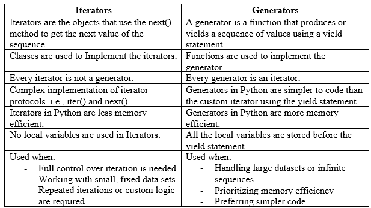
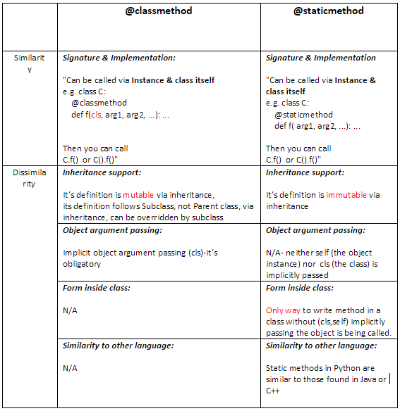
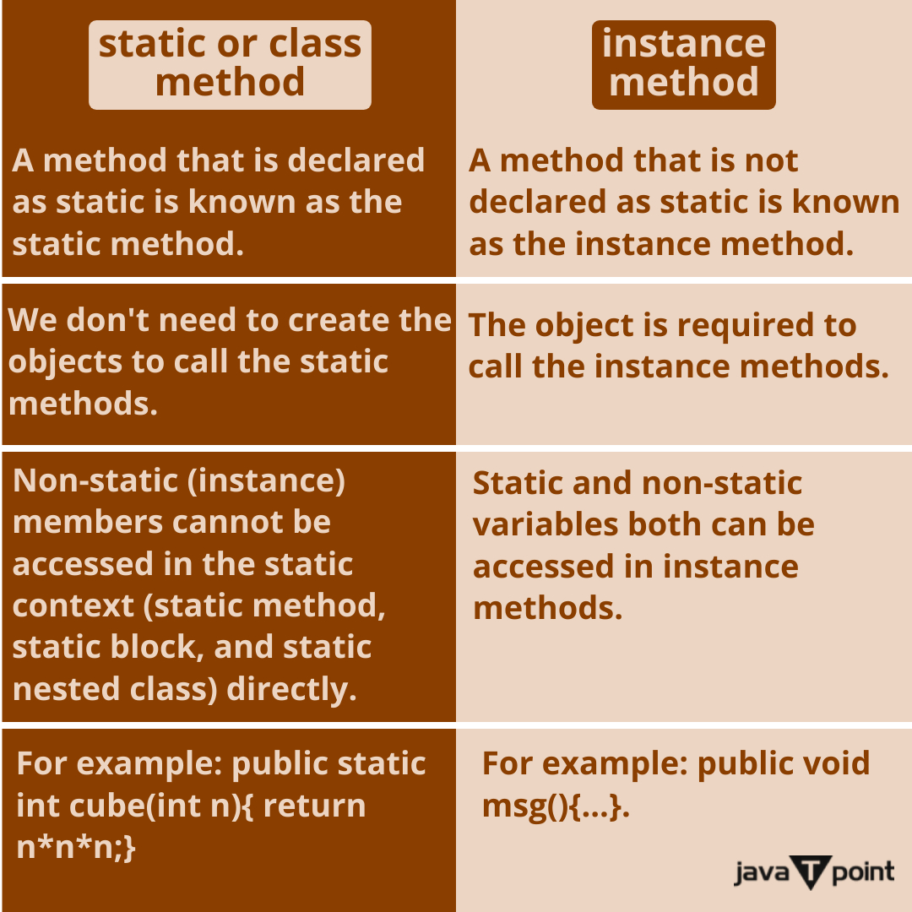

# Phase 5 — Pythonic & Advanced Python (Senior AI/ML Edition)

**Goal:** Master the internal mechanics of Python to write high-performance, memory-efficient, and structurally elegant ML pipelines and backend services.

---

## 1. Comprehensions, Iterators & Generators

As an AI/ML engineer, managing RAM/VRAM and pipeline I/O is critical. Eager evaluation (loading everything at once) crashes jobs; lazy evaluation (computing on the fly) saves them.

### Iterators vs. Generators
These terms are often confused, but they have a strict structural distinction in Python.

*   **Iterator:** An object that implements the **Iterator Protocol**—specifically the `__iter__()` and `__next__()` dunder methods. It maintains its own internal state using class instance attributes.
*   **Generator:** A *subset* of Iterators. It is a function that uses the `yield` keyword. Python automatically implements the `__iter__` and `__next__` methods for you, storing the local variable state in a C-level frame object when execution is suspended.

**The Difference:**
Use a **Generator** for simple, linear data streaming. Use a custom **Iterator class** when your iteration logic requires complex state management, external resets, or exposing multiple methods (e.g., a custom PyTorch `DataLoader` or `Dataset`).



```python
from typing import Iterator, List

# --- 1. Custom Iterator (Class-based) ---
# WHY: Useful when you need complex state tracking, or need to reset the iteration.
class BatchIterator:
    def __init__(self, data: List[float], batch_size: int):
        self.data = data
        self.batch_size = batch_size
        self.index = 0  # Explicit state management
        
    def __iter__(self) -> 'BatchIterator':
        return self     # Must return self to satisfy protocol
        
    def __next__(self) -> List[float]:
        if self.index >= len(self.data):
            raise StopIteration # Signals the end of the loop
            
        batch = self.data[self.index : self.index + self.batch_size]
        self.index += self.batch_size
        return batch

    def reset(self):
        """Custom logic impossible in a simple generator."""
        self.index = 0

# --- 2. Generator (Function-based) ---
# WHY: Less boilerplate. Python suspends the function's execution stack at 'yield'.
def batch_generator(data: List[float], batch_size: int) -> Iterator[List[float]]:
    for i in range(0, len(data), batch_size):
        yield data[i : i + batch_size]

# Usage context in ML:
data_stream = [0.1, 0.4, 0.5, 0.9, 0.2, 0.8]
iterator_instance = BatchIterator(data_stream, batch_size=2)
# Next() calls trigger the iteration
print(next(iterator_instance)) # [0.1, 0.4]
```

---

## 2. Functions & State Management

### Lambdas & Closures
Lambdas and closures allow you to encapsulate logic and state without the overhead of instantiating classes. 

*   **Lambdas:** Anonymous, single-expression functions. 
    *   *AI/ML Use Case:* Highly prevalent in Pandas `apply()`, map/reduce operations, or simple custom sorting logic.
    *   *Limitation:* Cannot contain statements (like `assert`, `return`, `pass`) or complex multi-line logic.

*   **Closures:** A closure occurs when a nested function captures and stores the variables from its enclosing (outer) lexical scope. Even if the outer function finishes executing, the inner function retains access to those variables via Python's `__closure__` dunder attribute (which stores variables in "cell" objects).
    *   *AI/ML Use Case:* Creating configurable metric functions, loss functions, or callbacks for training loops.

```python
from typing import Callable
import numpy as np

# --- Closure Example ---
def make_huber_loss(delta: float = 1.0) -> Callable[[np.ndarray, np.ndarray], np.ndarray]:
    """
    Outer function creates a closure environment capturing 'delta'.
    This is faster than instantiating a Class with __call__ for simple state.
    """
    def huber_loss(y_true: np.ndarray, y_pred: np.ndarray) -> np.ndarray:
        error = y_true - y_pred
        is_small_error = np.abs(error) <= delta
        
        # 'delta' is bound lexically from the outer scope
        squared_loss = 0.5 * np.square(error)
        linear_loss = delta * np.abs(error) - 0.5 * np.square(delta)
        
        return np.where(is_small_error, squared_loss, linear_loss)
    
    return huber_loss

# We create a specific loss function without needing an OOP class.
loss_fn = make_huber_loss(delta=2.0)
# print(loss_fn.__closure__) # Shows the C-level cell object storing delta=2.0

# --- The "Late Binding" Closure Gotcha (Senior Knowledge) ---
# A classic bug in ML pipelines when generating a list of callback functions.
# WRONG: All functions will yield '2' because closures bind to the *variable*, not the *value* at the time.
bad_callbacks = [lambda x: x * i for i in range(3)] 
print([cb(10) for cb in bad_callbacks]) # Outputs: [20, 20, 20]

# RIGHT: Force early binding using default arguments.
good_callbacks = [lambda x, i=i: x * i for i in range(3)]
print([cb(10) for cb in good_callbacks]) # Outputs: [0, 10, 20]
```

### Decorators
Decorators are higher-order functions that wrap other functions or classes to modify their behavior dynamically.
**When to use which type:**

1.  **Function Decorators (No arguments):** Best for simple logic (e.g., measuring execution time, basic `@torch.no_grad()` mimics).
2.  **Factory Decorators (With arguments):** Three-level nested functions. Use when the decorator needs configuration (e.g., `@retry(max_attempts=3)`).
3.  **Class-based Decorators:** Use when the decorator itself needs to maintain complex internal state (e.g., a caching mechanism that tracks cache hits/misses, or rate limiters).

```python
import time
from functools import wraps
from typing import Any

# --- 1. Class-based Decorator (Stateful) ---
# WHY: Easier to maintain complex state (like cache history) than using nested closures.
class MemoizeInference:
    def __init__(self, func):
        self.func = func
        self.cache = {}
        self.cache_hits = 0

    def __call__(self, *args, **kwargs) -> Any:
        # Freeze args to make them hashable for dict keys
        key = (args, frozenset(kwargs.items()))
        if key in self.cache:
            self.cache_hits += 1
            return self.cache[key]
        
        result = self.func(*args, **kwargs)
        self.cache[key] = result
        return result

@MemoizeInference
def expensive_model_inference(tensor_hash: str):
    time.sleep(2) # Simulate GPU compute
    return [0.1, 0.9]

# --- 2. Factory Decorator (Configurable) ---
def log_execution(level: str = "INFO"):
    """Outer function takes arguments, middle wraps, inner executes."""
    def decorator(func):
        @wraps(func) # Crucial: Preserves original func.__name__ and docstrings
        def wrapper(*args, **kwargs):
            start = time.perf_counter()
            result = func(*args, **kwargs)
            print(f"[{level}] {func.__name__} took {time.perf_counter() - start:.4f}s")
            return result
        return wrapper
    return decorator

@log_execution(level="DEBUG")
def preprocess_data(data):
    pass
```


---

## 3. Advanced Object-Oriented Topics

### `@property`, `@classmethod`, and `@staticmethod`
Understanding the distinction here is vital for designing robust ML library APIs.

*   **`@property`:** Turns a method into an attribute accessed without parentheses. 
    *   *Why use it?* Encapsulation and Lazy Evaluation. You can compute heavy matrices only when explicitly accessed, or validate data upon assignment (using `.setter`).
*   **`@classmethod`:** Receives the class (`cls`) as the first argument, not the instance.
    *   *Why use it?* Factory Patterns. This is how HuggingFace does `AutoModel.from_pretrained(path)`. It allows you to return alternative instances of the class based on different inputs.
*   **`@staticmethod`:** Receives neither `self` nor `cls`.
    *   *Why use it?* Namespace organization. It's just a regular function that lives inside a class namespace because it logically belongs there (e.g., a specific matrix math utility used by the model).

```python
import json

class MLModel:
    def __init__(self, weights: list, config: dict):
        self.weights = weights
        self._config = config
        self._compiled_graph = None # Internal state

    # --- @property (Lazy Evaluation & Encapsulation) ---
    @property
    def compiled_graph(self):
        """Computes the compute graph lazily ONLY when requested."""
        if self._compiled_graph is None:
            print("Compiling heavy C++ compute graph...")
            self._compiled_graph = "Graph[...]"
        return self._compiled_graph

    @property
    def threshold(self) -> float:
        return self._config.get("threshold", 0.5)

    @threshold.setter
    def threshold(self, value: float):
        if not (0.0 <= value <= 1.0):
            raise ValueError("Threshold must be between 0 and 1.")
        self._config["threshold"] = value

    # --- @classmethod (Alternative Constructor / Factory) ---
    @classmethod
    def from_json(cls, file_path: str) -> 'MLModel':
        """
        Reads a file and instantiates the class. 
        Using `cls(…)` ensures that if this class is subclassed, 
        it instantiates the subclass, not the parent class.
        """
        with open(file_path, 'r') as f:
            data = json.load(f)
        return cls(weights=data['weights'], config=data['config'])

    # --- @staticmethod (Utility) ---
    @staticmethod
    def calculate_sparsity(weights: list) -> float:
        """Doesn't need 'self' or 'cls'. Pure mathematical utility."""
        zeros = sum(1 for w in weights if w == 0)
        return zeros / len(weights) if weights else 0.0

# Usage
# model = MLModel.from_json("config.json") # Factory instantiation
# print(model.compiled_graph) # Triggers lazy compilation
```

### Metaclasses vs. `__init_subclass__`
*   **Metaclasses** intercept the creation of classes. They are notoriously complex. 
*   **Alternative:** In modern Python, use `__init_subclass__` for class registries (e.g., registering all custom PyTorch `nn.Module` layers automatically without metaclass magic).

```python
class LayerRegistry:
    # A central registry of all available neural network layers
    registered_layers = {}

    def __init_subclass__(cls, **kwargs):
        super().__init_subclass__(**kwargs)
        # Automatically registers any subclass upon definition
        LayerRegistry.registered_layers[cls.__name__] = cls

class AttentionLayer(LayerRegistry): pass
class ConvolutionLayer(LayerRegistry): pass

# Automatically populated without explicitly calling a registration function
print(LayerRegistry.registered_layers.keys()) 
# dict_keys(['AttentionLayer', 'ConvolutionLayer'])
```

---

## 4. Static Typing in Python (For Robustness)

### Generics & Protocols
In large ML codebases, functions must support multiple types (e.g., PyTorch Tensors, Numpy Arrays, Python Lists) safely.

*   **Generics (`TypeVar`):** Allow you to define a structure that enforces the *same* type across multiple methods, without specifying what that type is initially.
*   **Protocols (`typing.Protocol`):** Python's way of doing **Structural Subtyping (Duck Typing)**. Instead of forcing a class to inherit from a BaseClass, you just verify that it has the required methods. 
    *   *Why?* It breaks tight coupling. You can accept a HuggingFace tokenizer, a Spacy tokenizer, or a custom one, as long as they all implement an `encode()` method.

```python
from typing import Protocol, TypeVar, Generic, Any
import numpy as np

# --- Protocols (Duck Typing Enforcer) ---
class TokenizerProtocol(Protocol):
    def encode(self, text: str) -> list[int]: ...
    def decode(self, tokens: list[int]) -> str: ...

def process_text(text: str, tokenizer: TokenizerProtocol):
    """Accepts ANY object with encode/decode, no inheritance required."""
    tokens = tokenizer.encode(text)
    return tokens

# --- Generics ---
T = TypeVar('T', np.ndarray, list) # Constrained Generic

class DataBuffer(Generic[T]):
    def __init__(self):
        self.buffer: list[T] = []

    def add(self, item: T):
        self.buffer.append(item)

    def get_latest(self) -> T:
        return self.buffer[-1]

# Mypy statically ensures we don't mix np.ndarray and lists in the same buffer
numpy_buffer = DataBuffer[np.ndarray]()
numpy_buffer.add(np.array([1, 2, 3]))
```

---

## 5. Ecosystem Tools: Mypy & Pydantic

### Mypy (Static Analysis)
**What it is:** A tool that analyzes your code without running it to catch type violations.
**Why use it?** In ML, passing a float where an int is expected can cause silent failures deep in a training loop 10 hours later. Mypy catches this in CI/CD pipeline instantly.
*Alternative:* `pyright` (faster, built into VSCode Pylance).

### Pydantic (Runtime Validation)
**What it is:** A data serialization and validation library powered by type hints.
**Why use it?** While Mypy secures *internal* code, Pydantic secures *external* boundaries (e.g., reading hyperparameter YAMLs, serving inference via FastAPI). It forces dirty, untyped incoming data to conform to your strictly typed Python objects, coercing types when possible.
*Alternative:* `marshmallow` (older, heavier syntax), `attrs` (better for standard objects, but less robust validation out-of-the-box).

```python
from pydantic import BaseModel, Field, field_validator
from typing import List

class InferenceRequest(BaseModel):
    # Strict schema definition
    text: str = Field(..., min_length=1, max_length=1000)
    temperature: float = Field(default=0.7, ge=0.0, le=1.0)
    top_k: int = Field(default=50, gt=0)

    @field_validator('text')
    def sanitize_text(cls, v):
        """Custom runtime validation logic."""
        if "<script>" in v:
            raise ValueError("HTML tags not allowed in inference request.")
        return v.strip()

# Simulating an incoming JSON payload from an API request
incoming_json = {"text": "  Hello World  ", "temperature": "0.9"} # temp is a string here

# Pydantic parses, validates, and automatically coerces "0.9" to float
request = InferenceRequest(**incoming_json)
print(repr(request.text))        # 'Hello World' (stripped by validator)
print(type(request.temperature)) # <class 'float'>
```